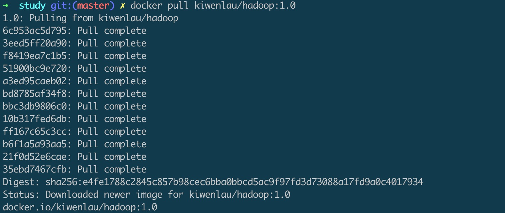
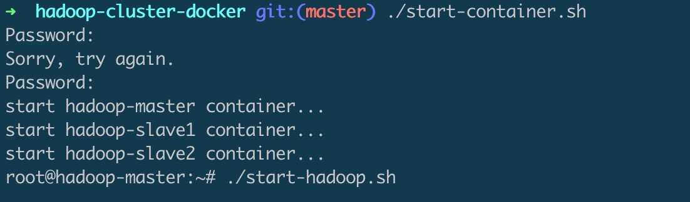
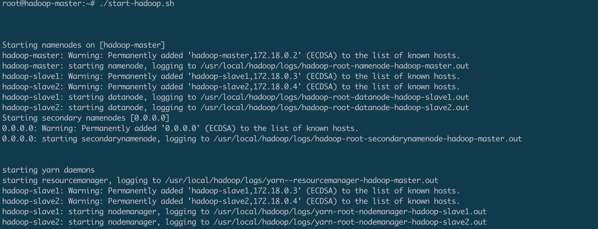
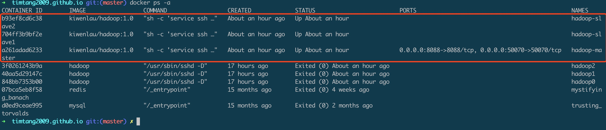
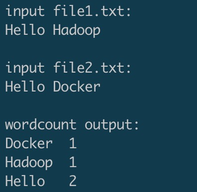
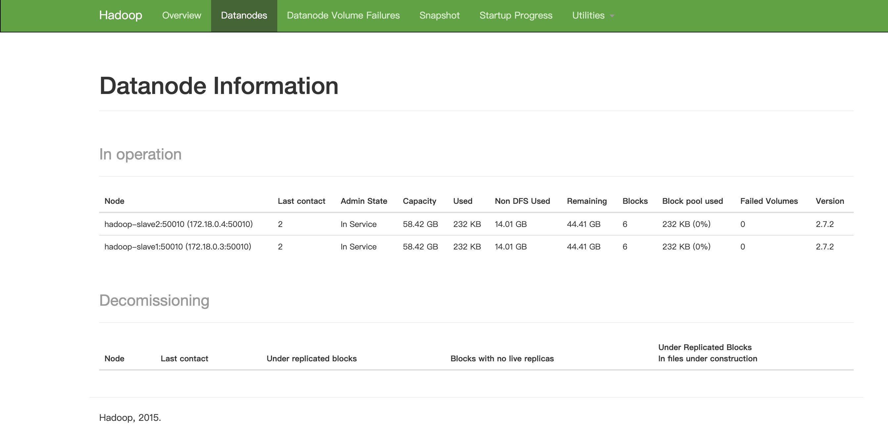
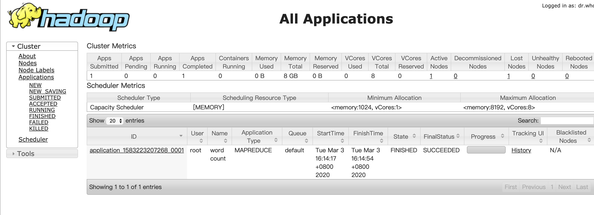

Mac用户本地通过docker部署轻量化hadoop集群
===========


- [1. 简介](#1-简介)
- [2. 下载Docker镜像](#2-下载Docker镜像)
- [3. 创建hadoop专属网络](#3-创建hadoop专属网络)
- [4. 运行docker容器](#4-运行docker容器)
- [5. 启动hadoop集群](#5-启动hadoop集群)
- [6. 查看管理hadoop节点](#6-查看管理hadoop节点)

## 前言
本文转载并总结于KiwenLau的git项目 https://github.com/kiwenlau/hadoop-cluster-docker ,用于快速且轻量化地搭建mac本地hadoop集群。侵删。

前置步骤：1. 需要在本机安装docker。mac用户可在docker官网直接下载docker并安装，非常方便。windows用户需要通过docker machine来安装，详情可以看我另一篇博客 [Windows用户配置开发环境指南](https://timtang2009.github.io/edge%20case/2017/10/04/windows-development.html)。 2. 熟悉docker的基本指令

## 1. 简介
Hadoop的master和slave分别运行在不同的Docker容器中，其中hadoop-master容器中运行NameNode和ResourceManager，hadoop-slave容器中运行DataNode和NodeManager。NameNode和DataNode是Hadoop分布式文件系统HDFS的组件，负责储存输入以及输出数据，而ResourceManager和NodeManager是Hadoop集群资源管理系统YARN的组件，负责CPU和内存资源的调度。

## 2. 下载Docker镜像
使用以下命令下载KiwenLau的docker镜像

```
docker pull kiwenlau/hadoop:1.0
```


pull完以后用docker images命令查看是否下载成功


下载GitHub仓库
```
git clone https://github.com/kiwenlau/hadoop-cluster-docker
```


## 3. 创建hadoop专属网络
运行以下命令创建hadoop本地网络：
```
docker network create --driver=bridge hadoop
```


## 4. 运行docker容器
进入git目录
```
cd hadoop-cluster-docker
```
启动docker容器
```
./start-container.sh
```



## 5. 启动hadoop集群
在容器中启动hadoop
```
./start-hadoop.sh
```


此时已经启动了一个master, 2个slave节点


再运行切词测试脚本
```
./run-wordcount.sh
```


## 6. 查看管理hadoop节点
Hadoop网页管理地址:
NameNode:  http://127.0.0.1:50070/

ResourceManager：  http://127.0.0.1:8088/


